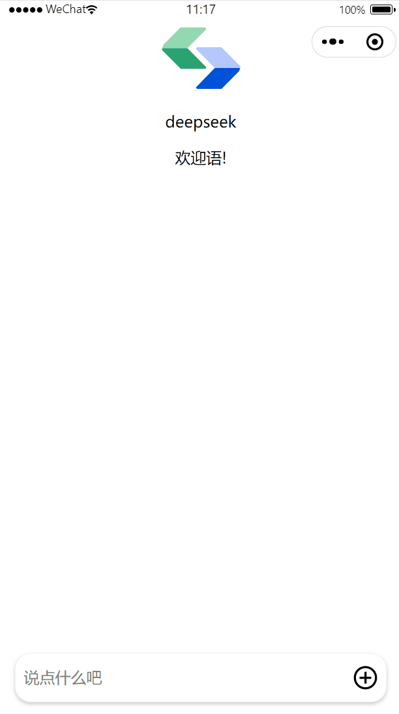

### 本项目已不再维护，可能存在少部分bug，请使用腾讯云开源的最新的sdk

### 介绍
本项目是使用uniapp开发的ai对话小程序，支持和deepseek对话，支持markdown，项目代码很少，可以方便的集成到自己的uniapp小程序里。

项目前端代码来自于“腾讯云云开发”的demo，但是将原生小程序代码转化为了uniapp代码。后端也是由“腾讯云云开发”提供，开发者也可以对接自己的后端接口。

### 页面效果



### 如何运行
- clone本项目，在hbuilder里打开
- 打开manifest.json文件，填入你的微信小程序的appid。**该小程序需要支持云开发，不能使用测试appid**
- 在hbuilder中点击：运行  -  运行到小程序模拟器
- 在微信开发者工具中，点击 ‘云开发’，创建一个云开发环境，开发期间是免费的，获得env id
- 回到hbuilder，将env id填写到app.js里，重新运行即可


### 如何集成到自己的uniapp小程序
- 复制components里面的agent-ui文件夹到自己的项目里
- 复制static里面的文件到自己的项目
- 给项目添加zpMixins插件：
  打开插件页面（https://test-ext.dcloud.net.cn/plugin?id=10361），点击下载插件并导入hbuilderx，选择你的项目，导入
-   按照本项目的main.js修改你的main.js，主要是导入zpMixins.
    主要是增加一下两行代码：
```
import zpMixins from '@/uni_modules/zp-mixins/index.js';
Vue.use(zpMixins);
```
- 在合适的地方初始化‘云开发’，比如在app.vue中：

```
onLaunch: function () {
        if (!wx.cloud) {
            console.error('请使用 2.2.3 或以上的基础库以使用云能力');
        } else {
            wx.cloud.init({
                env: 'your env id'
            });
            console.log(111);
        }
        this.globalData = {};
    }
```

- 开发ai对话页面，参考本项目的pages/index.vue
- 运行小程序，测试即可
### 相关文档
[用三行代码将DeepSeek 接入小程序| 腾讯云开发官方指南](https://blog.csdn.net/TCB_CloudBase/article/details/145637493)
